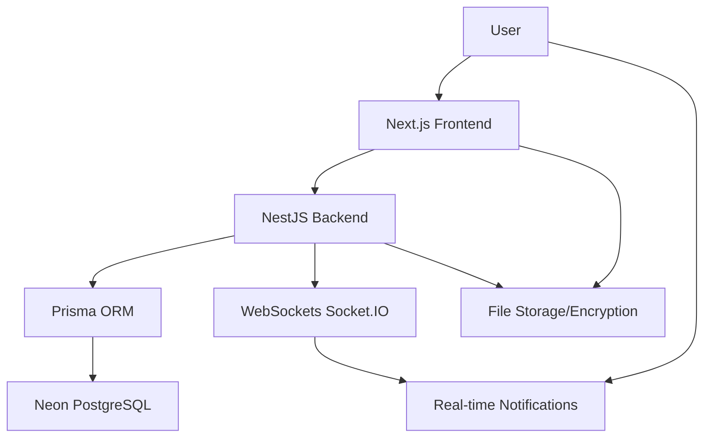

# Privora 14 - Project Plan

## Overview
Privora 14 is a secure, multi-user web application for encrypted file sharing. It features a Next.js frontend with Tailwind CSS, a NestJS backend with Prisma ORM connected to Neon PostgreSQL, real-time WebSockets, and internationalization support.

## Architecture Diagram

## Tech Stack
- **Frontend**: Next.js (App Router), TypeScript, Tailwind CSS
- **Backend**: NestJS, TypeScript, Prisma ORM
- **Database**: Neon (Serverless PostgreSQL)
- **Real-time**: Socket.IO
- **Deployment**: Vercel (Frontend), Vercel/Render (Backend)

## Key Features
- Multi-user authentication with JWT
- Encrypted file upload and sharing
- Real-time notifications
- Internationalization (English, French, Chinese)
- Responsive UI with blue-green theme
- Secure sessions and input validation

## Required Pages
1. Home (public)
2. About (public)
3. Help (public)
4. Sign Up (auth)
5. Login (auth)
6. Forgot Password (auth)
7. Dashboard (protected)
8. Send Page (protected)
9. Receive Page (protected)
10. File Manager (protected)
11. Settings (protected)

## Security Requirements
- Password hashing with bcrypt
- JWT tokens (access and refresh)
- Protected routes
- Input validation
- CORS protection
- Backend never decrypts files

## Database Schema Outline
- Users: id, email, password, createdAt, updatedAt
- Sessions: id, userId, token, expiresAt
- Files: id, name, size, type, encryptedData, senderId, createdAt
- Transfers: id, fileId, senderId, receiverId, status, createdAt
- Feedback: id, userId, rating, comment, createdAt
- AuditLogs: id, userId, action, details, createdAt

## Implementation Phases
1. Project Setup and Structure
2. Database Design and Setup
3. Backend Authentication and Core APIs
4. File Encryption and Transfer Logic
5. Frontend UI and Pages
6. Real-time Features
7. Internationalization
8. Security Hardening
9. Testing and Deployment Preparation

## Environment Variables
- Frontend: NEXT_PUBLIC_API_URL
- Backend: DATABASE_URL, JWT_SECRET, JWT_REFRESH_SECRET, FRONTEND_URL

This plan outlines the complete architecture and requirements for Privora 14. The todo list below breaks down the implementation into actionable steps.